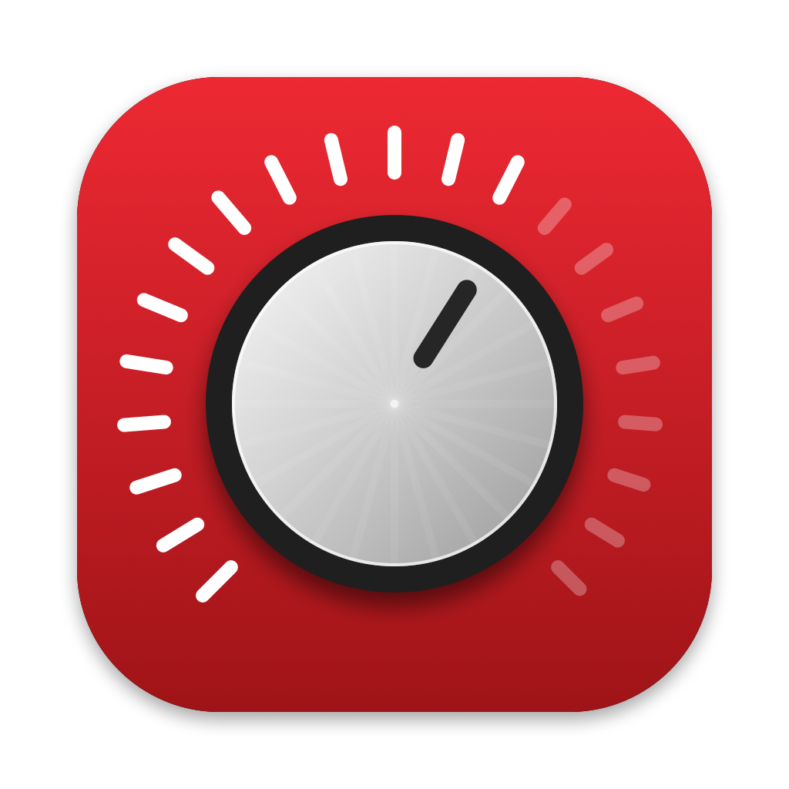

# SoloVolume

A tiny macOS menu bar app that gives a Focusrite Scarlett Solo (or any output with no
hardware volume control) a working volume slider and working keyboard volume keys.

macOS greys out the volume control for interfaces like the Scarlett Solo because the device
doesn't expose one. SoloVolume adds one in software, without installing any audio drivers.

## Features

- Menu bar volume slider and mute
- Keyboard volume and mute keys control the device (Shift+Option for fine steps), with an
  on-screen level indicator
- Keys pass through to macOS as normal when a different output (e.g. AirPods) is in use
- Picks the Scarlett automatically; any other output can be chosen
- Recovers when the device is unplugged and plugged back in
- Launch at login

Requires macOS 14.2 or later. Runs natively on Apple silicon and Intel.

## Install

1. Download the latest `SoloVolume-x.y.dmg` from [Releases](../../releases).
2. Open it and drag **SoloVolume** to **Applications**.
3. Open SoloVolume. It's signed and notarized, so it opens normally.
4. Allow **System Audio Recording** when asked. Without it, audio to the device goes silent.
5. For the volume keys, turn SoloVolume on in **System Settings → Privacy & Security →
   Accessibility** (the app's menu has a shortcut to this).
6. Click the speaker in the menu bar and turn on **Launch at login**.

## How it works

SoloVolume uses Core Audio process taps (macOS 14.2+):

1. A tap captures all audio other apps send to the device and mutes the original.
2. A private aggregate device (the device + the tap) plays that audio back to the device
   with gain applied (cubic taper, ramped per buffer so changes don't click).

The device's own inputs are left closed, so the microphone indicator stays off. If the app
quits, audio goes straight back to the device at **full volume**.

## Build from source

Needs the Xcode Command Line Tools (`xcode-select --install`).

```
./build.sh            # builds build/SoloVolume.app
./build.sh --install  # also copies it to /Applications and relaunches it
./build.sh --dmg      # also packages build/SoloVolume-<version>.dmg
```

If a "Developer ID Application" certificate is in your keychain, the app is signed with it
(hardened runtime), and `--dmg` also notarizes and staples the disk image using the
notarytool profile `pane-notary` (override with `NOTARY_PROFILE=...`). Create one with
`xcrun notarytool store-credentials <name> --apple-id <email> --team-id <team>`.

Without a Developer ID the build is ad-hoc signed, so macOS asks for the audio and
Accessibility permissions again after every rebuild.

Run with `SOLOVOLUME_DIAG=1` to print input levels to stderr once a second.

The icon is drawn by `Icon/make-icon.swift`; run `swift Icon/make-icon.swift` to regenerate it.

## Releasing

Bump `CFBundleShortVersionString` and `CFBundleVersion` in `Info.plist`, commit, then run
`./release.sh`. It tags the version and publishes a GitHub Release with the .dmg attached.

## License

MIT. Not affiliated with Focusrite or Rogue Amoeba.
